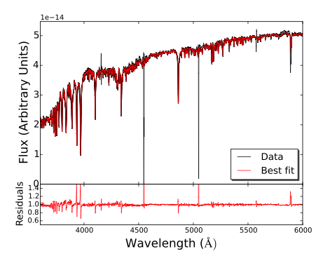

# Firefly
## Fitting Iteratively for Relative Likelihood Analysis (of Stellar Population Spectra, e.g. galaxies, star clusters, model spectra)


[FIREFLY](http://www.icg.port.ac.uk/firefly/) is a chi-squared minimisation fitting code for deriving the stellar population properties of stellar systems, be these observed galaxy or star cluster spectra, or model spectra from simulations. [FIREFLY](http://www.icg.port.ac.uk/firefly/) fits combinations of single-burst stellar population models to spectroscopic data, following an iterative best-fitting process controlled by the Bayesian Information Criterion. No priors are applied, rather all solutions within a statistical cut are retained with their weight, which is arbitrary. Moreover, no additive or multiplicative polynomia are employed to adjust the spectral shape and no regularisation is imposed. This fitting freedom allows one to map out the effect of intrinsic spectral energy distribution (SED) degeneracies, such as age, metallicity, dust reddening on stellar population properties, and to quantify the effect of varying input model components on such properties. Dust attenuation is included using a new procedure, which employs a High-Pass Filter (HPF) in order to rectify the continuum before fitting. The returned attenuation array is then matched to known analytical approximations to return an E(B-V) value. This procedure allows for removal of large scale modes of the spectrum associated with dust and/or poor flux calibration. The fitting method has been extensively tested with a comprehensive suite of mock galaxies, real galaxies from the Sloan Digital Sky Survey and Milky Way globular clusters. The robustness of the derived properties was assessed as a function of signal-to-noise ratio and adopted wavelength range. [FIREFLY](http://www.icg.port.ac.uk/firefly/) is able to recover age, metallicity, stellar mass and even the star formation history remarkably well down to a S/N~5, for moderately dusty systems. 

[FIREFLY](http://www.icg.port.ac.uk/firefly/) provides light- and mass-weighted stellar population properties - age, metallicity, E(B-V), stellar mass and its partition in remnants (white dwarfs, neutron stars, black-holes) - for the best fitting model and its components. The star formation rates for the individual components are given, the total past average can be easily obtained from the provided quantities. The star formation history can be easily derived by plotting the SSP contributions with their weights. Errors on these properties are obtained by the likelihood of solutions within the statistical cut. 

The code can in principle fit any model to any spectrum at any spectral resolution and over any wavelength range. At present, the code has been applied to spectra from SDSS, integrated and from Integral field Unit (MANGA), the DEEP2 survey and globular clusters from various sources.

In this newest version we inlcuded a number of bug fixes and updates as documented on Github. The file structure also has been streamlined.

## Acknowledgment

We are delighted you use our code! If you use our code, please cite the following papers:

* [Wilkinson et al. 2017](http://adsabs.harvard.edu/abs/2017MNRAS.472.4297W) for the code, its description and testing.
* [Comparat et al. 2018](https://arxiv.org/abs/1711.06575) for description of the SDSS-IV DR14 run and testing of the code performance.
* [Goddard et al. 2017](https://ui.adsabs.harvard.edu/abs/2017MNRAS.466.4731G) for description of the SDSS-IV/MANGA run and testing of the code performance.
* [Maraston & Stromback 2011](http://adsabs.harvard.edu/abs/2011MNRAS.418.2785M) for the M11 stellar population models.
* [Maraston et al 2020](https://ui.adsabs.harvard.edu/abs/2020MNRAS.tmp.1662M) for the MaStar stellar population models.


## Installation

Requirements: python 3 and its main packages all installable through pip: numpy, scipy, matplotlib, math ...
astro dependencies: astropy, installable with pip

```
git clone https://github.com/FireflySpectra/firefly_release
```

### Environmental variables
Environmental variables are now pre-set in the code tied to the running directory. Alternatively, you may set the environmental variables as follows.

Example for a .bashrc or .bash_profile file:
```
export FF_DIR='[your path to Firefly]/firefly_release-master'
export PYTHONPATH='${FF_DIR}/python:$PYTHONPATH'
export STELLARPOPMODELS_DIR=‘[your path to Firefly]/stellar_population_models'
```

Example for a .cshrc file:
```
setenv FF_DIR '[your path to Firefly]/firefly_release'
setenv PYTHONPATH ${PYTHONPATH}:${FF_DIR}/python
setenv STELLARPOPMODELS_DIR '[your path to Firefly]/stellar_population_models'
```

### How to run the code
Use the following command in the directorty where you installed Firefly:
```
python run/firefly.py
```
or
```
python run/firefly_sdss.py
```
or
```
python run/firefly_manga.py
```
To modify the input spectrum and other parameters edit one of these three python scripts. The following script provides an example how to read in Firefly output:
```
python run/read_firefly.py
```

## Stellar Population model templates 

Simple stellar population (SSP) model templates from [Maraston & Stromback 2011](http://adsabs.harvard.edu/abs/2011MNRAS.418.2785M) (M11) and [MaStar](http://www.icg.port.ac.uk/mastar/) are now included in the package for two initial mass functions (Kroupa and Salpeter).

## Content of this repository

**run** Scripts to run Firefly (general ascii input, or fixed SDSS or MaNGA fits file input).

**python** The Firefly code.

**data** Auxilliary files.

**example_data** Example data in ascii, and fits format.

**stellar_population_models** Stellar population model templates (MaStar and M11)
